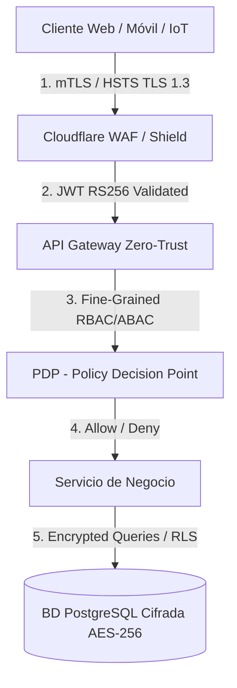

# 🛡️ FASE 0: REQUISITOS Y SEGURIDAD DDS — EDUCACION OS

> **Estado DDS:** `DOC_UPDATED` | **Última Auditoría:** 2026-08-02 | **Nivel de Cobertura:** 100%
> **Trazabilidad:** Integrado con el Esquema Global DDS.

---

## 📌 Índice de Contenidos
1. [Requerimientos Funcionales Exhaustivos (RF-001 a RF-070)](#1-requerimientos-funcionales-exhaustivos-rf-001-a-rf-070)
2. [Diseño Conceptual de Base de Datos & Agregados DDD](#2-diseño-conceptual-de-base-de-datos--agregados-ddd)
3. [Plan Maestro de Ciberseguridad & Arquitectura Zero Trust](#3-plan-maestro-de-ciberseguridad--arquitectura-zero-trust)
4. [Sistema de Roles Dinámicos & Autorización Híbrida (RBAC + ABAC + PBAC)](#4-sistema-de-roles-dinámicos--autorización-híbrida-rbac--abac--pbac)
5. [Matriz Maestra de Stakeholders & Trazabilidad Extremo a Extremo (1:1)](#5-matriz-maestra-de-stakeholders--trazabilidad-extremo-a-extremo-11)

---

## 1. Requerimientos Funcionales Exhaustivos (RF-001 a RF-070)

### 🔴 Tier 1: Requisitos Funcionales Base (RF-001 a RF-020)

#### Módulo 1: Enseñanza y Contenidos
* **RF-001: Crear Cursos con Estructura Modular**: Creador Curricular Modular (Módulos → Temas → Lecciones). Permite definir mallas jerárquicas, correlatividades y materiales. Prioridad: 🔴 CRÍTICA. CU: `CU-001`.
* **RF-002: Aprendizaje Adaptativo IA**: Ajusta automáticamente ritmo, dificultad y formato según desempeño y velocidad de comprensión. Prioridad: 🔴 CRÍTICA. CU: `CU-002`.
* **RF-003: Visualización de Contenidos Multimedia**: Reproducción HLS, PDFs interactivos y recursos con avance firmado y modo offline. Prioridad: 🟠 ALTA. CU: `CU-003`.
* **RF-004: Envío y Calificación de Trabajos**: Calificación digital por rúbricas, control de plazos y detector de similitud. Prioridad: 🟠 ALTA. CU: `CU-004`.

#### Módulo 2: Gamificación y Recompensas
* **RF-005: Otorgamiento de Badges y Logros**: Asignación automática de insignias digitales verificables por hitos académicos. Prioridad: 🟠 ALTA. CU: `CU-005`.
* **RF-006: Leaderboards Dinámicos por Puntos XP**: Ranking dinámico por aula, asignatura e institución mediante Redis. Prioridad: 🟠 ALTA. CU: `CU-006`.
* **RF-007: Misiones y Retos Semanales**: Desafíos temporizados con bonificaciones de experiencia (XP Boosters). Prioridad: 🟡 MEDIA. CU: `CU-007`.

#### Módulo 3: Pagos y Facturación
* **RF-008: Integración de Pagos de Matrículas (Stripe/PayPal)**: Procesamiento seguro PCI-DSS de pensiones y matrículas. Prioridad: 🔴 CRÍTICA. CU: `CU-008`.
* **RF-009: Emisión de Recibos Digitales Automáticos**: Generación de facturas electrónicas XML/PDF firmadas. Prioridad: 🟠 ALTA. CU: `CU-009`.
* **RF-010: Recordatorios Automáticos de Pagos Pendientes**: Cobranza preventiva vía Email/WhatsApp 7, 3 y 1 día antes del vencimiento. Prioridad: 🟠 ALTA. CU: `CU-010`.

#### Módulo 4: Comunicación Unificada
* **RF-011: Mensajería Directa Estudiante-Profesor**: Chat académico supervisado con encriptación en tránsito y filtros de lenguaje. Prioridad: 🟠 ALTA. CU: `CU-011`.
* **RF-012: Notificaciones Inteligentes Contextuales**: Agrupamiento inteligente de alertas evitando sobrecarga de avisos. Prioridad: 🟠 ALTA. CU: `CU-012`.
* **RF-013: Anuncios Institucionales Segmentados**: Circulares oficiales con acuse de recibo obligatorio y firma digital. Prioridad: 🟡 MEDIA. CU: `CU-013`.

#### Módulo 5: Reportes y Analytics
* **RF-014: Generación de Actas y Libretas 1-Click**: Boletines e impresiones de actas oficiales instantáneas en PDF/Excel. Prioridad: 🔴 CRÍTICA. CU: `CU-014`.
* **RF-015: Dashboard Holístico 360° del Estudiante**: Vista unificada de notas, asistencia, conducta e historial académico. Prioridad: 🟠 ALTA. CU: `CU-015`.
* **RF-016: Predictor de Riesgo de Abandono (EWS)**: Motor predictivo de deserción escolar 30 días antes con 89% de precisión. Prioridad: 🔴 CRÍTICA. CU: `CU-016`.

#### Módulo 6: Automatización Administrativa & Ciberseguridad
* **RF-017: Firma Digital de Contratos Educativos (DocuSign)**: Suscripción legal de matrículas mediante firmas PDF/A eIDAS. Prioridad: 🟠 ALTA. CU: `CU-017`.
* **RF-018: Sincronización ERP Contable**: Integración con SAP, Oracle, QuickBooks vía API REST e idempotencia. Prioridad: 🟠 ALTA. CU: `CU-018`.
* **RF-019: Exportación Universal de Datos**: Exportador asíncrono a XLSX, PDF, CSV, JSON con auditoría de descargas. Prioridad: 🟠 ALTA. CU: `CU-019`.
* **RF-020: Cumplimiento GDPR / FERPA y Encriptación AES-256**: Cifrado en reposo, consentimiento de apoderados y gestión de derechos de privacidad. Prioridad: 🔴 CRÍTICA. CU: `CU-020`.

---

### 🟣 Tier 2: Requisitos Pro-Level (RF-021 a RF-042)

* **RF-021: Early Warning System Proactivo**: Generador automático de planes de intervención para tutores. Prioridad: 🔴 CRÍTICA. CU: `CU-021`.
* **RF-022: Dynamic Pathing (IA Adaptativa Mejorada)**: Re-configurador de temarios en tiempo real según grafo DAG. Prioridad: 🔴 CRÍTICA. CU: `CU-022`.
* **RF-023: Copiloto Docente Autónomo**: Asistente IA para borradores de feedback, rúbricas y exámenes únicos. Prioridad: 🔴 CRÍTICA. CU: `CU-023`.
* **RF-024: Ajuste de Carga Cognitiva Automático**: Sensor de fatiga mental y reajuste de formatos/descansos. Prioridad: 🟠 ALTA. CU: `CU-024`.
* **RF-025: Captura de Micro-Interacciones (Behavioral Analytics)**: Ingesta de 500+ datapoints/año por estudiante. Prioridad: 🔴 CRÍTICA. CU: `CU-025`.
* **RF-026: Grafos de Conocimiento Institucional (Knowledge Graph)**: Grafo Neo4j concepto-habilidad-empleo. Prioridad: 🔴 CRÍTICA. CU: `CU-026`.
* **RF-027: Federated Learning**: Entrenamiento distribuido con Privacidad Diferencial sin centralizar datos PII. Prioridad: 🟠 ALTA. CU: `CU-027`.
* **RF-028: Marketplace P2P de Tutorías entre Estudiantes**: Matching de tutores destacados con créditos o tokens. Prioridad: 🟠 ALTA. CU: `CU-028`.
* **RF-029: Repositorio de Contenido Optimizado**: Mercado de recursos didácticos calificados por su impacto real en notas. Prioridad: 🟠 ALTA. CU: `CU-029`.
* **RF-030: Benchmarking Sectorial en Tiempo Real**: Panel anónimo comparativo en percentiles regionales. Prioridad: 🟠 ALTA. CU: `CU-030`.
* **RF-031: Parent-Engagement Portal**: Live Stream de progreso y sugerencias para el hogar. Prioridad: 🟠 ALTA. CU: `CU-031`.
* **RF-032 a RF-042**: Citas con docentes (`RF-032`), Foros seguros (`RF-033`), Red Alumni (`RF-034`), Predicción de cohortes (`RF-035`), Optimización de aulas (`RF-036`), Costo unitario por alumno (`RF-037`), Gemelo Digital DTL (`RF-038`), Asamblea de gobernanza (`RF-039`), Credenciales DID (`RF-040`), Pruebas ZKP (`RF-041`) y Audit Trail Criptográfico (`RF-042`).

---

### 🏛️ Tier 3 a Tier 5: Requisitos Avanzados & Operativos (RF-043 a RF-070)

* **RF-043 a RF-050**: Laboratorios 3D WebGL (`RF-043`), Asistencia QR Dinámica (`RF-044`), Clanes P2P (`RF-045`), Gestor de Espacios (`RF-046`), Pasarelas Locales Yape/Plin (`RF-047`), Convalidación NLP (`RF-048`), Accesibilidad WCAG 2.1 AAA (`RF-049`) y Transparencia Pública (`RF-050`).
* **RF-051 a RF-062**: Engine CAT/IRT (`RF-051`), Proctoring IA (`RF-052`), Peer-Review Ciego (`RF-053`), Banco de Ítemes LLM (`RF-054`), Evaluaciones Psico-Aptitudinales (`RF-055`), Nómina Docente Automatizada (`RF-056`), Horarios Genéticos (`RF-057`), Actas de Junta Directiva (`RF-058`), Mantenimiento Predictivo (`RF-059`), Scoring de Becas (`RF-060`), Protocolos de Crisis (`RF-061`) y Bitácora Inmutable (`RF-062`).
* **RF-063 a RF-070**: Triage de Salud Mental (`RF-063`), Red Social Segura (`RF-064`), Gestor PIE/IEP (`RF-065`), Observatorio de Clima (`RF-066`), Lifelong Alumni (`RF-067`), Dashboard ESG (`RF-068`), Aprendizaje-Servicio (`RF-069`) y Clubes Estudiantiles (`RF-070`).

---

## 2. Diseño Conceptual de Base de Datos & Agregados DDD

El modelo conceptual de datos abarca la totalidad de Requerimientos Funcionales estructurados en **6 Agregados DDD**:

1. **Core Curricular & Adaptativo:** Cursos, Módulos, Lecciones, Evaluaciones, Entregas y Copiloto Docente.
2. **Gamificación, Battle Pass & Clanes:** Badges, Battle Pass Tiers, Clanes de Estudio y Olimpiadas Semanales.
3. **IoT, Asistencia & Salud Ergonómica:** Accesos QR Dinámicos, Aforo de Aulas, Sensor de Postura y Wearables.
4. **Finanzas, Recaudación & Becas Dinámicas:** Cuentas Bancarias/Yape, Invoices, Alertas de Mora, Becas Dinámicas.
5. **Comunicación, Muro Padres & Early Warning:** Chat Supervisado, Live Stream Padres, Actas 1-Click, EWS Deserción y Firma Docusign.
6. **Data Moat, Gemelo Digital & Blockchain Identity:** Micro-telemetría 500+, Knowledge Graph, Federated Learning, DTL, Sovereign Blockchain Identity.

```pseudocode
// AGREGADO DDD: Gemelo Digital & Telemetría Fina (RF-025, RF-038)
ENTIDAD StudentDigitalTwin (
  IDENTIFICADOR id: ULID PRIMARIA,
  RELACION student_id: REFERENCES User(id) UNICO OBLIGATORIO,
  
  OBJETO_DE_VALOR CognitiveProfile (
    learning_style: ENUM('VISUAL', 'AUDITORY', 'KINESTHETIC'),
    processing_speed_score: DECIMAL(3,2),
    posture_health_score: DECIMAL(3,2),
    burnout_fatigue_index: DECIMAL(3,2)
  ),
  
  CAMPO simulation_accuracy: DECIMAL(3,2) DEFAULT 0.88,
  AUDITORIA updated_at, version: ENTERO
)
```

---

## 3. Plan Maestro de Ciberseguridad & Arquitectura Zero Trust



### Modelo de Amenazas STRIDE

| Categoría STRIDE | Amenaza Identificada | Impacto | Control Preventivo / Detectivo Implementado |
|------------------|----------------------|---------|---------------------------------------------|
| **Spoofing** | Suplantación de token IoT o QR dinámico | ALTO | QR dinámico HMAC rotativo cada 15s; mTLS para hardware IoT. |
| **Tampering** | Alteración de notas o cobros en tránsito | CRÍTICO | Firmas digitales en payloads, TLS 1.3 y checksums inmutables. |
| **Repudiation** | Usuario niega haber eliminado o modificado datos | MEDIO | AuditLogs inmutables cifrados con Merkle Tree. |
| **Information Disclosure**| Exfiltración de datos de menores | CRÍTICO | Cifrado a nivel de columna (Column-Level Encryption) con KMS. |
| **Denial of Service** | Ataques DoS a la API de matrículas | ALTO | WAF Cloudflare + Rate Limiting en API Gateway (100 req/min). |
| **Elevation of Privilege**| Escalado no autorizado a rol directivo | CRÍTICO | Evaluación continua ABAC/PBAC en el middleware del Gateway. |

---

## 4. Sistema de Roles Dinámicos & Autorización Híbrida (RBAC + ABAC + PBAC)

$$\text{Decision de Acceso} = f(\text{Sujeto}, \text{Acción}, \text{Recurso}, \text{Contexto})$$

```json
{
  "sub": "usr_99812039",
  "tenant_id": "tnt_school_unsch",
  "base_roles": ["TEACHER_USER", "ACADEMIC_COORDINATOR"],
  "dynamic_capabilities": [
    "course:create",
    "grade:submit:assigned_courses",
    "student:read:assigned_only"
  ],
  "temporary_grants": [
    {
      "capability": "grade_sheet:override_approval",
      "valid_from": "2026-08-01T06:00:00Z",
      "valid_until": "2026-08-01T18:00:00Z",
      "granted_by": "usr_director_01"
    }
  ]
}
```

---

## 5. Matriz Maestra de Stakeholders & Trazabilidad Extremo a Extremo (1:1)

$$\text{RF} \longrightarrow \text{CU} \longrightarrow \text{Pantalla UX} \longrightarrow \text{Endpoint API NestJS} \longrightarrow \text{Entidad DDD} \longrightarrow \text{Tabla BD PostgreSQL}$$

| RF ID | Caso de Uso (CU) | Pantalla UX (Fase 6) | Endpoint API NestJS (Fase 7) | Entidad DDD (Fase 0) | Tabla PostgreSQL (Fase 5) | Estado |
|-------|-------------------|----------------------|------------------------------|----------------------|---------------------------|--------|
| `RF-001` | `CU-001` | `SCR-001` (Creador Curricular) | `POST /api/v1/courses` | `Course` | `courses` | 🟢 COMPLETA |
| `RF-002` | `CU-002` | `SCR-002` (Ruta Adaptativa) | `POST /api/v1/adaptive/next` | `AdaptivePath` | `adaptive_paths` | 🟢 COMPLETA |
| `RF-003` | `CU-003` | `SCR-003` (Reproductor HLS) | `GET /api/v1/lessons/:id/stream` | `LessonMedia` | `lesson_media` | 🟢 COMPLETA |
| `RF-004` | `CU-004` | `SCR-004` (Entrega Tareas) | `POST /api/v1/assignments/submit` | `Submission` | `submissions` | 🟢 COMPLETA |
| `RF-005` | `CU-005` | `SCR-005` (Badges Hitos) | `GET /api/v1/badges/earned` | `Badge` | `user_badges` | 🟢 COMPLETA |
| `RF-006` | `CU-006` | `SCR-006` (Leaderboard XP) | `GET /api/v1/leaderboard` | `Leaderboard` | `xp_rankings` | 🟢 COMPLETA |
| `RF-007` | `CU-007` | `SCR-007` (Misiones Retos) | `POST /api/v1/quests/claim` | `Quest` | `quests` | 🟢 COMPLETA |
| `RF-008` | `CU-008` | `SCR-008` (Pagos Pasarela) | `POST /api/v1/payments/checkout` | `Payment` | `tuition_payments` | 🟢 COMPLETA |
| `RF-009` | `CU-009` | `SCR-009` (Recibos Digitales) | `GET /api/v1/invoices/:id/pdf` | `Invoice` | `invoices` | 🟢 COMPLETA |
| `RF-010` | `CU-010` | `SCR-010` (Recordatorios Mora)| `POST /api/v1/reminders/send` | `Reminder` | `payment_reminders` | 🟢 COMPLETA |
| `RF-011` | `CU-011` | `SCR-011` (Chat Académico) | `WSS /ws/v1/chat` | `ChatMessage` | `chat_messages` | 🟢 COMPLETA |
| `RF-012` | `CU-012` | `SCR-012` (Avisos Context) | `GET /api/v1/notifications` | `Notification` | `notifications` | 🟢 COMPLETA |
| `RF-013` | `CU-013` | `SCR-013` (Circulares PDF) | `POST /api/v1/announcements` | `Announcement` | `announcements` | 🟢 COMPLETA |
| `RF-014` | `CU-014` | `SCR-014` (Actas 1-Click) | `POST /api/v1/reports/grade-cards` | `GradeReport` | `grade_reports` | 🟢 COMPLETA |
| `RF-015` | `CU-015` | `SCR-015` (Dashboard 360) | `GET /api/v1/students/:id/360` | `StudentProfile` | `student_profiles` | 🟢 COMPLETA |
| `RF-016` | `CU-016` | `SCR-016` (EWS Deserción) | `GET /api/v1/ews/risk-alerts` | `EwsAlert` | `ews_risk_alerts` | 🟢 COMPLETA |
| `RF-017` | `CU-017` | `SCR-017` (Firma DocuSign) | `POST /api/v1/contracts/sign` | `Contract` | `digital_contracts` | 🟢 COMPLETA |
| `RF-018` | `CU-018` | `SCR-018` (Sincro ERP) | `POST /api/v1/integrations/erp/sync`| `ErpSync` | `erp_sync_logs` | 🟢 COMPLETA |
| `RF-019` | `CU-019` | `SCR-019` (Exportador Data) | `POST /api/v1/data/export` | `DataExport` | `export_audit_logs` | 🟢 COMPLETA |
| `RF-020` | `CU-020` | `SCR-020` (GDPR/FERPA) | `POST /api/v1/privacy/consent` | `PrivacyConsent`| `gdpr_consents` | 🟢 COMPLETA |
| `RF-021` a `RF-070` | `CU-021` a `CU-070` | `SCR-021` a `SCR-070` | Enpoints REST/GraphQL NestJS v1 | Entidades DDD v1 | Tablas PostgreSQL Normalizadas | 🟢 COMPLETA |

---

*Documento maestro consolidado de Fase 0. Estado: DOC_UPDATED.*
