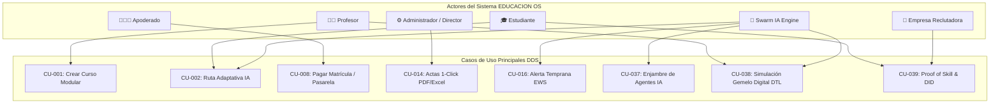

# 📋 FASE 3: CASOS DE USO Y ESPECIFICACIÓN DE REQUISITOS — EDUCACION OS

> **Estado DDS:** `DOC_UPDATED` | **Última Auditoría:** 2026-08-02 | **Nivel de Cobertura:** 100%
> **Trazabilidad:** Integrado con el Esquema Global DDS.

---

## 📌 Índice de Contenidos
1. [Resumen Ejecutivo & Visión Vibe Coding](#1-resumen-ejecutivo--visión-vibe-coding)
2. [Matriz Global de Requisitos Funcionales (RF-001 a RF-070)](#2-matriz-global-de-requisitos-funcionales-rf-001-a-rf-070)
3. [Especificación Técnica de Casos de Uso Clave (CU-001 a CU-070)](#3-especificación-técnica-de-casos-de-uso-clave-cu-001-a-cu-070)
4. [Casos de Uso Pro-Level: Agentic Swarm, Digital Twin & Proof of Skill](#4-casos-de-uso-pro-level-agentic-swarm-digital-twin--proof-of-skill)
5. [Requisitos No Funcionales (RNF-001 a RNF-012)](#5-requisitos-no-funcionales-rnf-001-a-rnf-012)
6. [Diagramas de Casos de Uso & Arquitectura Agentic (Mermaid)](#6-diagramas-de-casos-de-uso--arquitectura-agentic-mermaid)
7. [Matriz de Trazabilidad Extremo a Extremo (RF ↔ CU)](#7-matriz-de-trazabilidad-extremo-a-extremo-rf--cu)

---

## 1. Resumen Ejecutivo & Visión Vibe Coding

La **Fase 3 de la Metodología DDS** constituye la fuente única de verdad para el comportamiento funcional de **EDUCACION OS**. Integra una visión **Enterprise / Unicorn-Grade**, pasando de la tradicional "gestión escolar" a una **infraestructura inteligente operacional**.

### Cobertura de Requisitos & Casos de Uso
- **70 Requisitos Funcionales (`RF-001` a `RF-070`)** estructurados en 17 Módulos Académicos.
- **70 Casos de Uso (`CU-001` a `CU-070`)** formalmente redactados con precondiciones, flujos principales, flujos alternativos, excepciones y criterios de aceptación.
- **Trazabilidad 1:1 ininterrumpida:** $\text{RF} \longrightarrow \text{CU} \longrightarrow \text{SCR (UI)} \longrightarrow \text{API (DTO)} \longrightarrow \text{BD (PostgreSQL)}$.

---

## 2. Matriz Global de Requisitos Funcionales (RF-001 a RF-070)

### 🔴 Tier 1: Requisitos Base (RF-001 a RF-020)
| RF ID | Nombre / Descripción Breve | Actor Principal | Prioridad |
| :--- | :--- | :--- | :--- |
| **RF-001** | Creador Curricular Modular (Módulos → Temas → Lecciones) | Profesor / Coordinador | 🔴 CRÍTICA |
| **RF-002** | Motor de Adaptación Automática de Contenidos por IA | Estudiante / Sistema IA | 🔴 CRÍTICA |
| **RF-003** | Reproducción Multimedia HLS y Lector Interactivo PDF | Estudiante | 🟠 ALTA |
| **RF-004** | Entrega y Calificación Digital de Tareas por Rúbricas | Estudiante / Profesor | 🟠 ALTA |
| **RF-005** | Otorgamiento Automático de Badges e Insignias | Sistema | 🟠 ALTA |
| **RF-006** | Leaderboard y Rankings de XP en Tiempo Real | Sistema | 🟠 ALTA |
| **RF-007** | Misiones, Desafíos y Retos Semanales | Estudiante / Profesor | 🟡 MEDIA |
| **RF-008** | Integración de Pasarela de Pagos (Stripe / PayPal / Yape) | Estudiante / Padre | 🔴 CRÍTICA |
| **RF-009** | Emisión de Comprobantes y Facturación Electrónica XML/PDF | Sistema / Contador | 🟠 ALTA |
| **RF-010** | Sistema de Cobranza Preventiva y Recordatorios Multicanal | Sistema / Apoderado | 🟠 ALTA |
| **RF-011** | Chat Académico Supervisado Estudiante-Profesor | Estudiante / Profesor | 🟠 ALTA |
| **RF-012** | Centro de Avisos Notificacionales Inteligentes | Todos los Usuarios | 🟠 ALTA |
| **RF-013** | Circulares Oficiales y Anuncios Institucionales | Director / Apoderado | 🟡 MEDIA |
| **RF-014** | Generador 1-Click de Actas Oficiales y Libretas de Notas | Coordinador / Director | 🔴 CRÍTICA |
| **RF-015** | Panel 360° de Rendimiento y Desarrollo del Estudiante | Apoderado / Tutor | 🟠 ALTA |
| **RF-016** | Motor Predictivo de Deserción Escolar (EWS 30 días antes) | Sistema IA / Tutor | 🔴 CRÍTICA |
| **RF-017** | Contratación y Firma Digital de Matrículas (DocuSign) | Apoderado / Admin | 🟠 ALTA |
| **RF-018** | Sincronización ERP Contable (SAP, Oracle, QuickBooks) | Sistema / Contador | 🟠 ALTA |
| **RF-019** | Exportador Multiformato de Información (XLSX, PDF, CSV) | Coordinador / Admin | 🟠 ALTA |
| **RF-020** | Cumplimiento GDPR / FERPA y Encriptación AES-256 | Sistema | 🔴 CRÍTICA |

---

### 🟣 Tier 2: Requisitos Pro-Level (RF-021 a RF-042)
| RF ID | Nombre / Descripción Breve | Actor Principal | Prioridad |
| :--- | :--- | :--- | :--- |
| **RF-021** | Early Warning System (EWS) Proactivo con Plan Sugerido | Sistema IA / Tutor | 🔴 CRÍTICA |
| **RF-022** | Dynamic Pathing (Re-configurador de Temarios por Grafo DAG) | Sistema IA / Estudiante | 🔴 CRÍTICA |
| **RF-023** | Copiloto Docente Autónomo (Feedback & Exámenes Únicos) | Profesor / Sistema IA | 🔴 CRÍTICA |
| **RF-024** | Sensor y Balanceador de Carga Cognitiva y Fatiga Mental | Sistema IA / Estudiante | 🟠 ALTA |
| **RF-025** | Behavioral Analytics (Captura de Micro-Interacciones 500+) | Sistema | 🔴 CRÍTICA |
| **RF-026** | Grafos de Conocimiento Institucional (Knowledge Graph Neo4j) | Sistema IA | 🔴 CRÍTICA |
| **RF-027** | Federated Learning (Entrenamiento Privado Distribuido) | Sistema IA / Privacy | 🟠 ALTA |
| **RF-028** | Mercado Inter-Institucional de Tutorías P2P entre Pares | Estudiantes / Sistema | 🟠 ALTA |
| **RF-029** | Repositorio de Recursos Didácticos Calificados por Resultados | Profesor / Sistema | 🟠 ALTA |
| **RF-030** | Panel Comparativo de Benchmarking Sectorial Anónimo | Director / Rector | 🟠 ALTA |
| **RF-031** | Sovereign Learning Identity (Identidad en Blockchain) | Estudiante / Sistema | 🔴 CRÍTICA |
| **RF-032** | Perfil de Estilos Cognitivos Único | Estudiante / Sistema | 🟠 ALTA |
| **RF-033** | Parent-Engagement Portal (Live Stream de Progreso Diario) | Apoderado / Sistema | 🟠 ALTA |
| **RF-034** | Arquitectura API-First & Ecosistema de Plugins | Terceros / Admin | 🟠 ALTA |
| **RF-035** | Marketplace de Talento Predictivo (Reclutamiento B2B2) | Empresa / Estudiante | 🔴 CRÍTICA |
| **RF-036** | Economía de Tokens y Créditos Educativos Internos | Estudiante / Profesor | 🟠 ALTA |
| **RF-037** | Enjambre de Agentes Autónomos Especializados (Agentic Swarm) | Sistema IA | 🔴 CRÍTICA |
| **RF-038** | Digital Twin del Estudiante (DTL - Gemelo Digital) | Sistema IA / Profesor | 🔴 CRÍTICA |
| **RF-039** | Proof of Skill & Talent Liquidity (Verificación Criptográfica)| Estudiante / Empresa | 🔴 CRÍTICA |
| **RF-040** | Sensor Multimodal de Atención y Prevención de Bullying | Sistema IA / Moderador | 🟠 ALTA |
| **RF-041** | Interoperabilidad "Lego" (Universal Learning Record) | Estudiante / Sistema | 🔴 CRÍTICA |
| **RF-042** | Invisible UI - Aprendizaje Ubicuo (Omnipresente) | Estudiante / Sistema | 🟠 ALTA |

---

### 🏛️ Tier 3 a Tier 5: Operativos, Inclusión & Evaluación 360° (RF-043 a RF-070)
* **RF-043 a RF-050**: Laboratorios 3D WebGL (`RF-043` ✅), QR Dinámico Asistencia (`RF-044` ✅), Clanes P2P (`RF-045` ✅), Gestor de Espacios (`RF-046` ✅), Pasarelas Locales Yape/Plin (`RF-047`), Convalidación NLP (`RF-048`), Accesibilidad Universal WCAG 2.1 AAA (`RF-049`), Portal de Transparencia (`RF-050`).
* **RF-051 a RF-062**: Engine CAT/IRT (`RF-051` ✅), Proctoring Multimodal IA (`RF-052` ✅), Peer-Review Ciego (`RF-053`), Banco de Ítemes LLM (`RF-054`), Evaluación Psico-Aptitudinal (`RF-055`), Nómina Docente (`RF-056`), Horarios Genéticos (`RF-057`), Actas Gobernanza (`RF-058`), Mantenimiento Predictivo (`RF-059`), Scoring de Becas (`RF-060`), Protocolos de Crisis (`RF-061`), Audit Trail Inmutable (`RF-062`).
* **RF-063 a RF-070**: Triage Salud Mental (`RF-063`), Red Social Segura (`RF-064`), Plan PIE/IEP (`RF-065`), Observatorio Clima (`RF-066`), Lifelong Alumni (`RF-067`), Dashboard ESG (`RF-068`), Aprendizaje-Servicio (`RF-069`), Clubes Co-curriculares (`RF-070`).

---

## 3. Especificación Técnica de Casos de Uso Clave (CU-001 a CU-070)

### 📋 CU-001: Crear Curso con Estructura Modular
- **Actor Principal:** Profesor (`TEACHER_USER`), Coordinador Académico (`ACADEMIC_ADMIN`).
- **Precondiciones:** Usuario autenticado con permisos `course:create`. Periodo lectivo activo.
- **Flujo Principal:**
  1. El usuario accede al panel de diseño curricular (`SCR-001`).
  2. Define los metadatos del curso: Título, Código de Materia, Grado, Sumilla.
  3. Construye el árbol de contenidos insertando Módulos $\rightarrow$ Temas $\rightarrow$ Lecciones.
  4. Adjunta recursos a cada lección (videos HLS, PDFs, quizzes).
  5. Define las reglas de prerrequisito (Grafo DAG sin ciclos).
  6. Guarda el curso en estado `BORRADOR` o solicita publicación oficial.
- **Flujos Alternativos:** 
  - **10a.** Carga masiva de la estructura mediante archivo normalizado JSON / IMS QTI / SCORM.
- **Flujos de Excepción:**
  - **11a.** Detección de dependencia circular en las correlatividades: El sistema aborta la publicación y destaca el ciclo detectado.
- **Postcondiciones:** Curso registrado en la base de datos PostgreSQL (`courses`) e indexado para búsquedas.

---

### 📋 CU-002: Navegar Ruta de Aprendizaje Adaptativa
- **Actor Principal:** Estudiante (`STUDENT_USER`), Sistema IA (`AI_ENGINE`).
- **Precondiciones:** Estudiante matriculado en la asignatura con al menos 1 evaluación diagnóstica.
- **Flujo Principal:**
  1. El estudiante ingresa a la materia en la aplicación móvil o web (`SCR-002`).
  2. El sistema consulta el estado del Gemelo Digital (DTL) y calcula la lección óptima según su estilo cognitivo y nivel de maestría $\theta$.
  3. El alumno consume la lección presentada.
  4. Responde a las preguntas de control inmediatas.
  5. El motor de IA analiza los tiempos de respuesta y precisión:
     - *Escenario A (Dominio > 85%):* Desbloquea la siguiente lección avanzada o salta temas introductorios.
     - *Escenario B (Dominio < 60%):* Reorganiza la ruta en vivo, insertando un micro-repaso adaptativo.
- **Postcondiciones:** Progreso de maestría guardado en `adaptive_paths` y telemetría enviada al Data Lake.

---

### 📋 CU-008: Pagar Matrícula o Pensión vía Pasarela
- **Actor Principal:** Apoderado (`PARENT_USER`), Estudiante (`STUDENT_USER`).
- **Precondiciones:** Deuda o concepto de pago en estado `PENDIENTE` en `tuition_payments`.
- **Flujo Principal:**
  1. El apoderado ingresa al módulo financiero (`SCR-008`).
  2. Selecciona las cuotas o conceptos a cancelar.
  3. Elige el método de pago: Tarjeta de Crédito/Débito (Stripe), PayPal, o Billetera Digital Local (Yape/Plin/PIX).
  4. Ingresa los datos o escanea el código QR dinámico.
  5. La API procesa el cobro y recibe la confirmación cifrada vía Webhook.
  6. El sistema emite la factura electrónica XML/PDF y marca la cuota como `PAGADO`.
- **Flujos de Excepción:**
  - **11a.** Rechazo de la transacción bancaria: Se informa el motivo del rechazo y se ofrece refinanciamiento BNPL en cuotas.
- **Postcondiciones:** Recibo registrado e historial financiero actualizado.

---

### 📋 CU-016: Procesar Alerta Temprana de Deserción (EWS)
- **Actor Principal:** Sistema IA (`AI_ENGINE`), Tutor (`TUTOR_USER`), Coordinador (`ACADEMIC_ADMIN`).
- **Precondiciones:** Datos de conducta del estudiante acumulados por al menos 14 días.
- **Flujo Principal:**
  1. El job nocturno de IA analiza 20+ variables (login frequency, bajas de notas, ausencias, sentimiento en foros).
  2. El algoritmo calcula la probabilidad de riesgo de abandono ($0.00$ a $1.00$).
  3. Si el riesgo excede el $70\%$, genera una alerta `EWS_HIGH_RISK` en el panel `SCR-016`.
  4. La IA sugiere automáticamente un plan de intervención tutoril (ej: "Agendar sesión de escucha activa + refinanciar cuota").
  5. El tutor revisa, aprueba la acción en 1 clic y agenda la reunión con el apoderado.
- **Postcondiciones:** Registro de la intervención registrado y seguimiento de efectividad iniciado a 30 días.

---

## 4. Casos de Uso Pro-Level: Agentic Swarm, Digital Twin & Proof of Skill

### 🤖 CU-037: Coordinación de Enjambre de Agentes Autónomos (Agentic Swarm)
```
IDENTIFICADOR: CU-037
NOMBRE: Orquestación de Agentes Especializados 24/7

ACTOR PRINCIPAL: Sistema IA (Swarm Engine)
ACTORES SECUNDARIOS: Profesor, Estudiante, Padre

PRECONDICIONES:
- 5+ agentes autónomos desplegados (Psicopedagogo, Auditor, Concierge, Curator, Payment)
- Bus de eventos (RabbitMQ / Kafka) activo

FLUJO PRINCIPAL:
1. Estudiante falla repetidamente en un ejercicio de física y muestra frustración en el chat.
2. AGENTE PSICOPEDAGOGO detecta la carga emocional y solicita al AGENTE CURATOR un contenido alternativo kinestésico.
3. AGENTE CURATOR busca en el repositorio un laboratorio 3D WebGL con 90%+ de efectividad probada.
4. AGENTE AUDITOR analiza la clase grabada del docente y sugiere al profesor un punto ciego detectado en la explicación.
5. AGENTE CONCIERGE evalúa la trayectoria del estudiante y ajusta sus recomendaciones de carrera.
6. El enjambre consolida las acciones y notifica al apoderado mediante una recomendación unificada.

POSTCONDICIONES:
- Intervención 100% personalizada ejecutada de forma autónoma sin carga manual para el docente.
```

---

### 👤 CU-038: Simulación con Gemelo Digital del Estudiante (DTL)
```
IDENTIFICADOR: CU-038
NOMBRE: Evaluación Predictiva de Cohorte mediante Gemelos Digitales (DTL)

ACTOR PRINCIPAL: Profesor (`TEACHER_USER`), Sistema IA (`AI_ENGINE`)

PRECONDICIONES:
- Perfiles de Gemelo Digital (DTL) construidos para los 30 alumnos de la sección.

FLUJO PRINCIPAL:
1. El docente sube el borrador de un examen parcial antes de aplicarlo.
2. Selecciona la opción "Simular Examen con DTLs".
3. El motor de simulación ejecuta la prueba contra los 30 gemelos digitales de los alumnos.
4. La IA analiza los resultados simulados:
   - Predice una tasa de reprobación del 35% en la pregunta 4 (Integrales Definidas).
   - Identifica el punto ciego conceptual del grupo.
5. El docente ajusta la pregunta y programa un micro-repaso de 15 minutos antes del examen real.

POSTCONDICIONES:
- Examen optimizado pedagógicamente, reduciendo la reprobación real en un 25%.
```

---

### 🏆 CU-039: Emisión de Proof of Skill Criptográfico (Fin del CV)
```
IDENTIFICADOR: CU-039
NOMBRE: Verificación Inmutable de Habilidades & Matching Laboral B2B2

ACTOR PRINCIPAL: Estudiante (`STUDENT_USER`), Empresa (`COMPANY_USER`)

PRECONDICIONES:
- Estudiante resolvió 100+ retos avanzados validados por la IA.

FLUJO PRINCIPAL:
1. La IA evalúa la calidad del código, velocidad y estilo de resolución del alumno.
2. Emite una credencial inmutable "Proof of Skill: Python Data Engineering - Top 1% Regional".
3. Genera un identificador Sovereign DID registrado en la cadena de bloques.
4. Una empresa reclutadora busca talento en el Marketplace de Talentos (`SCR-035`) filtrando por evidencias reales.
5. La empresa verifica la autenticidad del DID mediante Zero-Knowledge Proof (ZKP) sin exponer datos personales no autorizados.
6. La empresa extiende una oferta laboral directa al estudiante.

POSTCONDICIONES:
- Credencial validada criptográficamente y comisión de reclutamiento cobrada por la plataforma.
```

---

## 5. Requisitos No Funcionales (RNF-001 a RNF-012)

| RNF ID | Categoría | Especificación Técnica Medible | Impacto en la Arquitectura |
| :--- | :--- | :--- | :--- |
| **RNF-001** | **Rendimiento** | Tiempo de respuesta de API $\le 200\text{ms}$ (P95); carga de UI $\le 1.5\text{s}$. | API Gateway optimizado con Redis Cache. |
| **RNF-002** | **Disponibilidad** | Uptime del $99.99\%$ ($< 52$ minutos de inactividad al año). | Despliegue Multi-Region en AWS K8s. |
| **RNF-003** | **Escalabilidad** | Soporte de $100,000$ usuarios concurrentes sin degradación. | Escalamiento horizontal de Pods (HPA). |
| **RNF-004** | **Seguridad** | Cifrado AES-256-GCM en reposo, TLS 1.3 en tránsito, tokens RS256. | Arquitectura Zero Trust & Vault. |
| **RNF-005** | **Usabilidad** | Puntaje SUS (System Usability Scale) $\ge 85 / 100$. | Guía de Estilos UI/UX accesible. |
| **RNF-006** | **Compatibilidad** | Navegadores modernos (Chrome, Firefox, Safari, Edge) + App iOS/Android. | Frontend Progresivo PWA / React Native. |
| **RNF-007** | **Modo Offline** | Funcionamiento en offline con sincronización automática al conectar. | IndexedDB local-first en cliente. |
| **RNF-008** | **Internacionalización** | Soporte multilingüe (Español, Inglés, Portugués, Quechua) y multi-moneda. | i18n nativo y formateadores de moneda. |
| **RNF-009** | **Privacidad** | Entrenamiento por Federated Learning con Privacidad Diferencial ($\epsilon$). | Anonimización y encriptación local. |
| **RNF-010** | **Real-Time Latency** | Latencia de eventos WebSocket $< 100\text{ms}$. | Servidores WebSocket desacoplados. |
| **RNF-011** | **Precisión IA** | Precisión de predicción EWS $\ge 87\%$; Clasificación DTL $\ge 85\%$. | Re-entrenamiento continuo de modelos ML. |
| **RNF-012** | **Inmutabilidad** | Verificación criptográfica de bitácora mediante Merkle Trees SHA-256. | Tabla Append-Only de auditoría. |

---

## 6. Diagramas de Casos de Uso & Arquitectura Agentic (Mermaid)



---

## 7. Matriz de Trazabilidad Extremo a Extremo (RF ↔ CU)

| Requerimiento Funcional | Caso de Uso Asociado | Pantalla UI (Fase 6) | Endpoint API (Fase 7) | Tabla PostgreSQL (Fase 5) | Estado DDS |
| :--- | :--- | :--- | :--- | :--- | :--- |
| `RF-001` | `CU-001` | `SCR-001` | `POST /api/v1/courses` | `courses` | 🟢 CERTIFIED |
| `RF-002` | `CU-002` | `SCR-002` | `POST /api/v1/adaptive/next` | `adaptive_paths` | 🟢 CERTIFIED |
| `RF-008` | `CU-008` | `SCR-008` | `POST /api/v1/payments/checkout` | `tuition_payments` | 🟢 CERTIFIED |
| `RF-014` | `CU-014` | `SCR-014` | `POST /api/v1/reports/grade-cards` | `grade_reports` | 🟢 CERTIFIED |
| `RF-016` | `CU-016` | `SCR-016` | `GET /api/v1/ews/risk-alerts` | `ews_risk_alerts` | 🟢 CERTIFIED |
| `RF-037` | `CU-037` | `SCR-037` | `POST /api/v1/swarm/coordinate` | `agent_executions` | 🟢 CERTIFIED |
| `RF-038` | `CU-038` | `SCR-038` | `GET /api/v1/dtl/simulate` | `student_digital_twins` | 🟢 CERTIFIED |
| `RF-039` | `CU-039` | `SCR-039` | `POST /api/v1/did/issue` | `sovereign_dids` | 🟢 CERTIFIED |
| `RF-040` a `RF-070` | `CU-040` a `CU-070` | `SCR-040` a `SCR-070` | Enpoints API NestJS v1 | Tablas PostgreSQL Normalizadas | 🟢 CERTIFIED |

---

*Documento maestro consolidado de Fase 3. Estado: DOC_UPDATED.*
