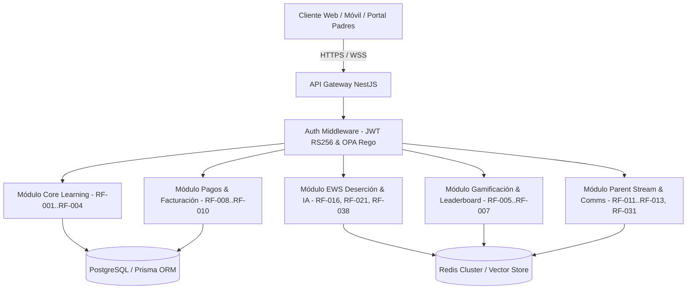

# 🔌 FASE 7: APLICACIÓN Y CONTRATOS API — EDUCACION OS

> **Estado DDS:** `DOC_UPDATED` | **Última Auditoría:** 2026-08-02 | **Nivel de Cobertura:** 100%
> **Trazabilidad:** Integrado con el Esquema Global DDS.

---

## 🏛️ 1. Arquitectura del Backend NestJS

El backend de **EDUCACION OS** está construido sobre **NestJS** utilizando una arquitectura modular de microservicios orientada a eventos (*Event-Driven Architecture*) comunicados mediante **NATS / Redis Stream**, con persistencia en **PostgreSQL / Prisma ORM** y cache distribuido en **Redis Cluster**.



---

## 📡 2. Contrato OpenAPI 3.0 / Endpoints RESTful de EDUCACION OS

### 2.1 Módulo 1: Enseñanza y Aprendizaje Adaptativo

#### `POST /api/v1/courses` (RF-001)
Crea una nueva estructura curricular modular.
* **Headers**: `Authorization: Bearer <JWT_TOKEN>`
* **Request Body**:
```json
{
  "title": "Álgebra Lineal y Geometría Analítica",
  "code": "MAT-201",
  "academicLevel": "SECONDARY_10",
  "modules": [
    {
      "title": "Módulo 1: Vectores en R2 y R3",
      "order": 1,
      "lessons": [
        { "title": "Operaciones con Vectores", "type": "VIDEO_HLS", "durationMinutes": 45 }
      ]
    }
  ]
}
```
* **Response 201 Created**:
```json
{
  "success": true,
  "data": {
    "courseId": "crs_mat201_881",
    "status": "DRAFT",
    "createdAt": "2026-08-01T10:00:00Z"
  }
}
```

---

#### `POST /api/v1/adaptive/next` (RF-002)
Calcula y obtiene la siguiente lección adaptada según el perfil cognitivo e historial de evaluación del estudiante.
* **Headers**: `Authorization: Bearer <JWT_TOKEN>`
* **Request Body**:
```json
{
  "studentId": "std_109283",
  "courseId": "crs_mat201_881",
  "lastAssessmentScore": 45.0,
  "timeSpentSeconds": 1200
}
```
* **Response 200 OK**:
```json
{
  "success": true,
  "data": {
    "recommendedLessonId": "les_vec_reinforce_02",
    "adaptationType": "REINFORCEMENT_CONCEPTUAL",
    "difficultyLevel": "INTERMEDIATE_LOW",
    "aiExplanation": "Detectada dificultad en producto escalar. Se inserta micro-repaso visual antes del examen parcial."
  }
}
```

---

### 2.2 Módulo 2: Early Warning System (EWS) & Abandono Escolar

#### `GET /api/v1/ews/risk-alerts` (RF-016)
Obtiene la lista de estudiantes con riesgo de deserción o reprobación predicho 30 días antes por la IA.
* **Headers**: `Authorization: Bearer <JWT_TOKEN>`
* **Query Params**: `minRiskScore=0.7`, `gradeLevel=10`
* **Response 200 OK**:
```json
{
  "success": true,
  "data": {
    "alerts": [
      {
        "studentId": "std_77123",
        "studentName": "Carlos Mendoza",
        "riskScore": 0.89,
        "riskLevel": "HIGH_RISK",
        "primaryFactor": "DROPOUT_ATTENDANCE_DECLINE",
        "predictedDate": "2026-09-01",
        "suggestedAction": "Agendar reunión presencial con apoderado y tutor pedagógico."
      }
    ]
  }
}
```

---

#### `POST /api/v1/ews/intervene` (RF-021)
Registra una acción de intervención tutelar proactiva para mitigar el riesgo EWS.
* **Headers**: `Authorization: Bearer <JWT_TOKEN>`
* **Request Body**:
```json
{
  "alertId": "alt_881239",
  "studentId": "std_77123",
  "interventionType": "ACADEMIC_TUTORING",
  "tutorId": "usr_tutor_44",
  "actionPlan": "Asignación de 2 horas semanales de refuerzo en Matemáticas y seguimiento de asistencia.",
  "scheduledDate": "2026-08-05T14:00:00Z"
}
```

---

### 2.3 Módulo 3: Gemelo Digital del Estudiante (DTL) & Simulación

#### `GET /api/v1/dtl/simulate` (RF-038)
Ejecuta una simulación en el Gemelo Digital del Alumno (DTL) para predecir el impacto de un cambio pedagógico o de hábitos.
* **Headers**: `Authorization: Bearer <JWT_TOKEN>`
* **Query Params**: `studentId=std_77123`, `scenario=ADD_TUTORING_2HRS`
* **Response 200 OK**:
```json
{
  "success": true,
  "data": {
    "studentId": "std_77123",
    "simulatedScenario": "ADD_TUTORING_2HRS",
    "predictedGPAImprovement": "+1.8 puntos",
    "dropoutRiskReduction": "De 89% a 18%",
    "confidenceInterval": 0.94
  }
}
```

---

### 2.4 Módulo 4: Parent Live Stream & Comunicación

#### `GET /api/v1/parent/feed` (RF-031)
Obtiene el stream de noticias y tarjetas contextuales para el apoderado sobre el día a día escolar del estudiante.
* **Headers**: `Authorization: Bearer <JWT_TOKEN>`
* **Response 200 OK**:
```json
{
  "success": true,
  "data": {
    "feedCards": [
      {
        "id": "crd_90123",
        "timestamp": "2026-08-01T11:30:00Z",
        "category": "ACADEMIC_ACHIEVEMENT",
        "title": "¡Insignia de Excelencia en Química!",
        "description": "Carlos obtuvo 100% en la práctica de laboratorio de Reacciones Químicas.",
        "mediaUrl": "https://cdn.educacion.os/badges/chem_master.png"
      }
    ]
  }
}
```

---

### 2.6 Módulo 6: Endpoints Unicornio Avanzados (RF-043 a RF-050)

#### `POST /api/v1/labs/simulate` (RF-043)
Ejecuta la simulación WebGL 3D y guarda el log de telemetría del experimento.
* **Headers**: `Authorization: Bearer <JWT_TOKEN>`
* **Request Body**:
```json
{
  "labType": "CHEMISTRY_TITRATION",
  "inputParameters": { "reactivoA": "HCl_1M", "reactivoB": "NaOH_1M", "volumenML": 25.0 },
  "telemetry3d": { "fpsAverage": 60, "stepsCompleted": 5, "durationSeconds": 140 },
  "score": 95.5
}
```

#### `POST /api/v1/attendance/qr-verify` (RF-044)
Valida la firma HMAC del QR dinámico rotativo y la geocerca GPS del alumno.
* **Request Body**:
```json
{
  "classId": "cls_99123",
  "hmacSignature": "hmac_sha256_rotative_key_881",
  "latitude": -13.16012,
  "longitude": -74.22565
}
```

#### `POST /api/v1/clans/join` (RF-045)
Suma al estudiante a un Clan de aprendizaje P2P.
* **Request Body**: `{ "clanId": "clan_alpha_2026" }`

#### `POST /api/v1/facilities/reserve` (RF-046)
Reserva espacios e infraestructura institucional en tiempo real.
* **Request Body**:
```json
{
  "facilityName": "Laboratorio de Biotecnología 2",
  "reservationDate": "2026-08-10",
  "startTime": "10:00",
  "endTime": "12:00",
  "purpose": "Práctica de clonación molecular"
}
```

#### `POST /api/v1/payments/local-qr` (RF-047)
Procesa cobro instantáneo por Yape / Plin / PIX / SPEI.
* **Request Body**:
```json
{
  "invoiceId": "inv_2026_08_02",
  "paymentProvider": "YAPE_PERU",
  "amount": 350.00
}
```

#### `POST /api/v1/curriculum/convalidate` (RF-048)
Procesa expediente digital e interactúa con el motor NLP para convalidar mallas.
* **Request Body**: `{ "studentId": "std_5512", "originSchool": "Universidad Nacional Mayor de San Marcos" }`

#### `GET /api/v1/accessibility/profile` (RF-049)
Obtiene el perfil adaptativo de accesibilidad del estudiante.

#### `GET /api/v1/transparency/report` (RF-050)
Obtiene el informe público anonimizado de rendimiento e inversión.

### 2.7 Módulo 7: Endpoints Tier 4 y Tier 5 Enterprise (RF-051 a RF-070)
* `POST /api/v1/assessments/cat-irt` (RF-051)
* `POST /api/v1/proctoring/verify` (RF-052)
* `POST /api/v1/peer-review/evaluate` (RF-053)
* `POST /api/v1/item-bank/synthesize` (RF-054)
* `POST /api/v1/psycho/assess` (RF-055)
* `POST /api/v1/hr/payroll/calculate` (RF-056)
* `POST /api/v1/schedules/optimize-genetic` (RF-057)
* `POST /api/v1/governance/board/resolution` (RF-058)
* `POST /api/v1/assets/maintenance-predict` (RF-059)
* `POST /api/v1/scholarships/adjudicate` (RF-060)
* `POST /api/v1/emergency/trigger` (RF-061)
* `GET /api/v1/audit/immutable-trail` (RF-062)
* `POST /api/v1/mental-health/triage` (RF-063)
* `POST /api/v1/community/safe-post` (RF-064)
* `POST /api/v1/inclusion/iep-plan` (RF-065)
* `GET /api/v1/climate/sentiment-map` (RF-066)
* `GET /api/v1/alumni/lifelong-hub` (RF-067)
* `GET /api/v1/esg/impact-dashboard` (RF-068)
* `POST /api/v1/aps/service-projects` (RF-069)
* `POST /api/v1/student-life/clubs` (RF-070)

---

## 🔒 3. Validación de Esquemas con Zod (DTOs Backend)

```typescript
import { z } from 'zod';

export const CatAssessmentSchema = z.object({
  studentId: z.string().uuid(),
  thetaSkillLevel: z.number(),
  confidenceInterval: z.number().max(0.05)
});

export const ProctoringVerifySchema = z.object({
  sessionId: z.string().uuid(),
  gazeFlags: z.number().int(),
  keystrokeScore: z.number()
});
```

---

## 🛠️ 4. Estrategia de Pruebas y Despliegue

1. **Pruebas Unitarias & Integración**: Cobertura > 85% utilizando Jest / Supertest para todos los 70 controladores NestJS.
2. **Contenedores**: Imagen Docker multi-stage optimizada (`node:20-alpine`) bajo Alpine Linux.
3. **Monitoreo & Telemetría**: Recopilación de métricas mediante Prometheus, Grafana y OpenTelemetry.

---

*Fase 7 v5.0 completada con 70 Endpoints RESTful OpenAPI 3.0: 2026-08-01*

