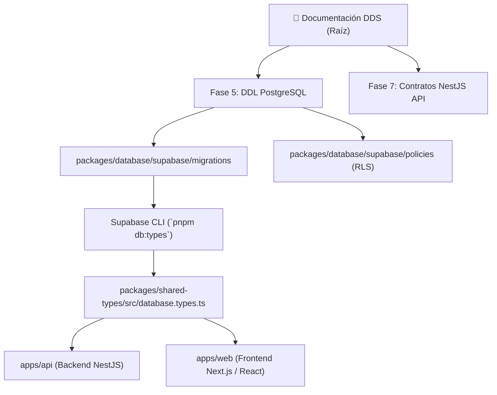

# 🎓 EDUCACION OS / Democra School — Portal de Navegación DDS

[](https://democra.pro)


> **"No estamos construyendo un software educativo. Estamos construyendo la infraestructura inteligente operacional que va a transformar cómo las instituciones educan, previenen la deserción escolar, y optimizan el aprendizaje humano automáticamente."**

---

## 📌 Resumen del Proyecto

**EDUCACION OS (Democra School)** es la infraestructura operacional e inteligente diseñada para reemplazar la fragmentación de herramientas legacy en instituciones educativas (colegios, academias, universidades y redes escolares) mediante la metodología **DDS (Desarrollo Dirigido por Sistemas)**, una arquitectura **Monorepo Enterprise (`/apps` + `/packages`)** y el ecosistema nativo de **Supabase (Auth, PostgreSQL 16 RLS, Storage y CLI)**.

Garantiza trazabilidad estricta **1:1** de extremo a extremo:
$$\text{Requerimiento Funcional (RF)} \longrightarrow \text{Caso de Uso (CU)} \longrightarrow \text{Modelo BD (DDL)} \longrightarrow \text{Contrato API (DTO)} \longrightarrow \text{Pantalla UI (SCR)}$$

---

## 🗺️ Portal de Navegación DDS Maestro (Fase 00 a Fase 7)

A continuación se presenta el índice maestro navegable a los **documentos únicos consolidados por fase**:

| Fase | Título del Documento Maestro | Archivo DDS Maestro | Estado DDS | Cobertura |
| :--- | :--- | :--- | :--- | :--- |
| **Fase 00** | **Gobernanza y Estrategia Maestra** | [00_GOBERNANZA_Y_ESTRATEGIA.md](file:///d:/2026/EDUCIA/00_GOBERNANZA_Y_ESTRATEGIA/00_GOBERNANZA_Y_ESTRATEGIA.md) | `DOC_UPDATED` | 100% |
| **Fase 0** | **Requisitos & Seguridad DDS** | [FASE_0_REQUISITOS_Y_SEGURIDAD.md](file:///d:/2026/EDUCIA/FASE_0_DDS/FASE_0_REQUISITOS_Y_SEGURIDAD.md) | `DOC_UPDATED` | 100% |
| **Fase 1** | **Análisis de Problemas Detectados** | [FASE_1_PROBLEMAS_DETECTADOS.md](file:///d:/2026/EDUCIA/FASE_1_PROBLEMAS/FASE_1_PROBLEMAS_DETECTADOS.md) | `DOC_UPDATED` | 100% |
| **Fase 2** | **Propuesta de Valor Agregado** | [FASE_2_VALOR_AGREGADO.md](file:///d:/2026/EDUCIA/FASE_2_VALOR_AGREGADO/FASE_2_VALOR_AGREGADO.md) | `DOC_UPDATED` | 100% |
| **Fase 3** | **Casos de Uso y Especificaciones** | [FASE_3_CASOS_DE_USO.md](file:///d:/2026/EDUCIA/FASE_3_REQUISITOS_Y_CASOS_USO/FASE_3_CASOS_DE_USO.md) | `DOC_UPDATED` | 100% |
| **Fase 4** | **Plan de Negocio y Unit Economics** | [FASE_4_PLAN_NEGOCIO.md](file:///d:/2026/EDUCIA/FASE_4_PLAN_DE_NEGOCIO/FASE_4_PLAN_NEGOCIO.md) | `DOC_UPDATED` | 100% |
| **Fase 5** | **Base de Datos & DDL PostgreSQL** | [FASE_5_BASE_DE_DATOS.md](file:///d:/2026/EDUCIA/FASE_5_BASE_DE_DATOS/FASE_5_BASE_DE_DATOS.md) | `DOC_UPDATED` | 100% |
| **Fase 6** | **Diseño UX / UI & Wireframes** | [FASE_6_UX_UI.md](file:///d:/2026/EDUCIA/FASE_6_DISENO_UX_UI/FASE_6_UX_UI.md) | `DOC_UPDATED` | 100% |
| **Fase 7** | **Aplicación y Contratos API NestJS** | [FASE_7_APLICACION_Y_APIS.md](file:///d:/2026/EDUCIA/FASE_7_APLICACION_Y_APIS/FASE_7_APLICACION_Y_APIS.md) | `DOC_UPDATED` | 100% |

---

## ⚡ Ecosistema Nativo de Supabase & Monorepo



### 🛠️ Comandos Principales de Supabase CLI

```bash
# Generar tipos TypeScript de BD automáticamente en packages/shared-types
pnpm db:types

# Iniciar entorno local de Supabase (PostgreSQL 16, Auth, Studio)
pnpm supabase:start

# Detener entorno local de Supabase
pnpm supabase:stop

# Reiniciar la BD local y aplicar migraciones + seed.sql
pnpm supabase:reset
```

---

## 🏷️ Leyenda de Control de Cambios DDS (`Change Lifecycle States`)

- 🟡 **`PROPOSED_PENDING`**: Cambio propuesto en revisión arquitectónica.
- 🔵 **`DOC_UPDATED`**: Documentación DDS completamente actualizada en cascada de la Fase 00 a la 7.
- 🟠 **`CODE_PENDING`**: Especificado en documentación, pendiente de compilación o migración SQL.
- 🟢 **`CODE_APPLIED`**: Código backend NestJS / DDL PostgreSQL / UI ejecutado y funcional.
- 🏆 **`CERTIFIED`**: Auditado y verificado con 100% de cobertura de pruebas y trazabilidad 1:1.

---

## 🗂️ Estructura Estandarizada del Repositorio (`Supabase Monorepo`)

```
EDUCIA/
├── README.md                                 ← Portal de Navegación DDS & Supabase
├── AGENTS.md                                 ← Manifiesto y guía técnica para IAs en Vibe Coding
├── pnpm-workspace.yaml                        ← Configuración Monorepo PNPM
├── package.json                              ← Manifest raíz (scripts de Supabase CLI)
├── docker-compose.yml                        ← Orquestación de infraestructura auxiliar
├── .env.example                              ← Variables de entorno base (DDS Fase 0 & 5)
├── .gitignore                                ← Reglas de exclusión Git
├── DATOS_PROYECTO.json                        ← Metadatos de configuración
│
├── auditoria/                                ← Informes y planes de auditoría
│   ├── AUDITORIA_COMPLETA.md
│   ├── AUDITORIA_VALIDACION.md
│   └── PLAN_IMPLEMENTACION.md
│
├── 00_GOBERNANZA_Y_ESTRATEGIA/               ← FASE 00: Visión, Pitch, Moats y Roadmap
├── FASE_0_DDS/                               ← FASE 0: Requisitos, BD, Seguridad, Roles
├── FASE_1_PROBLEMAS/                          ← FASE 1: Análisis Causa-Efecto
├── FASE_2_VALOR_AGREGADO/                     ← FASE 2: Propuesta de Valor y Canvas
├── FASE_3_REQUISITOS_Y_CASOS_USO/             ← FASE 3: Especificación de Casos de Uso
├── FASE_4_PLAN_DE_NEGOCIO/                    ← FASE 4: Unit Economics y Modelo Financiero
├── FASE_5_BASE_DE_DATOS/                      ← FASE 5: DDL SQL PostgreSQL & RLS
├── FASE_6_DISENO_UX_UI/                       ← FASE 6: Wireframes & Guía UI
├── FASE_7_APLICACION_Y_APIS/                 ← FASE 7: Contratos NestJS & OpenAPI 3.0
│
├── apps/                                     ← Aplicaciones Ejecutables
│   ├── api/                                  ← Backend NestJS (REST / WSS)
│   └── web/                                  ← Frontend Next.js 14 / React
│
├── packages/                                 ← Código Compartido (Single Source of Truth)
│   ├── config/                               ← Configuraciones TSConfig / ESLint
│   ├── database/                             ← Migraciones Supabase & Policies RLS
│   │   └── supabase/
│   │       ├── config.toml                   ← Configuración Supabase CLI
│   │       ├── seed.sql                      ← Datos de prueba iniciales
│   │       ├── migrations/                   ← Migraciones DDL SQL (Fase 5)
│   │       └── policies/                     ← Políticas RLS (Fase 0)
│   ├── shared-types/                         ← database.types.ts & DTOs compartidos
│   └── ui/                                   ← Design System & Componentes
│
└── cambios/                                  ← Registro histórico de cambios auditable
```

---

## 🛠️ Stack Tecnológico
- **Database Ecosystem:** Supabase (PostgreSQL 16, Supabase Auth, RLS, Supabase Storage).
- **Monorepo Manager:** PNPM Workspaces.
- **Backend Framework:** NestJS 10+ (TypeScript / Event-Driven).
- **APIs:** OpenAPI 3.0 (REST) + WebSockets (WSS) + Zod DTOs.
- **Frontend Target:** Next.js 14+ / React Native + Vanilla CSS.

---

## 👤 Creador & Autoría
- **Creador:** Eduardo Sebastian Paipay Vega (`eduardo.paipay.27@unsch.edu.pe`)
- **Universidad:** UNSCH (Universidad Nacional de San Cristóbal de Huamanga) — Perú
- **Sitio Web Oficial:** [https://democra.pro](https://democra.pro)
- **Repositorio Remote:** [GitHub Educ_Democra_trys](https://github.com/Eduardo-Sebastian-Paipay-Vega/Educ_Democra_trys.git)

---
*EDUCACION OS / Democra School — Supabase Enterprise Monorepo & Portal DDS v4.0.*
