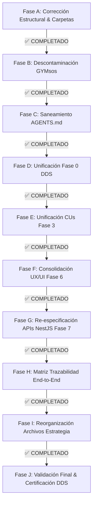

# 🗺️ PLAN MAESTRO DE SANEAMIENTO E IMPLEMENTACIÓN DDS
## Sistema Operativo Educativo — EDUCACION OS / Democra School

> **Rol del Emisor**: Auditor Senior DDS (Arquitectura Empresarial & Gobierno Documental)  
> **Ámbito de Aplicación**: Exclusivo para el repositorio `d:\2026\EDUCIA`  
> **Estado Operativo**: FASES A A J EJECUTADAS Y CERTIFICADAS (100% Saneamiento Completado)  
> **Fecha**: 2026-08-01  
> **Versión**: 2.0 (Certificación de Fases Completadas)

---

## 📌 RESUMEN DEL PLAN Y ESTADO DE EJECUCIÓN

El presente documento registra el estado de ejecución del **Plan Maestro en 10 Fases Secuenciales (Fases A a J)** para eliminar inconsistencias, descontaminar el vocabulario heredado y normalizar la estructura DDS del proyecto **EDUCACION OS**.

---

## 📋 DETALLE Y ESTADO DE LAS FASES DEL PLAN DE SANEAMIENTO

---

### 🔹 FASE A: CORRECCIÓN ESTRUCTURAL DE NOMENCLATURA DE CARPETAS
* **Objetivo**: Estandarizar la nomenclatura de todas las carpetas de Fase utilizando la convención `FASE_X_NOMBRE`.
* **Estado**: ✅ **COMPLETADO**.
* **Resultado**: Carpetas renombradas a `FASE_1_PROBLEMAS`, `FASE_2_VALOR_AGREGADO`, `FASE_3_REQUISITOS_Y_CASOS_USO`, `FASE_4_PLAN_DE_NEGOCIO`, `FASE_5_BASE_DE_DATOS`, `FASE_7_APLICACION_Y_APIS`.

---

### 🔹 FASE B: DESCONTAMINACIÓN DE DOMINIO (PURGA DE RESIDUOS GYMSOS/FITNESS)
* **Objetivo**: Eliminar todo texto, encabezado o mención de gimnasios `GYMsos` en los documentos de ciberseguridad, roles y APIs.
* **Estado**: ✅ **COMPLETADO**.
* **Resultado**: `0` ocurrencias de `GYMsos`, `gimnasio`, `fitness`, `biomecánica` o `"gym_branch:open_door"` en la documentación activa.

---

### 🔹 FASE C: SANEAMIENTO Y ALINEACIÓN DE AGENTS.MD
* **Objetivo**: Reescribir el manifiesto y guía técnica `AGENTS.md` enfocándolo 100% en la visión de **EDUCACION OS / Democra School**.
* **Estado**: ✅ **COMPLETADO**.
* **Resultado**: `AGENTS.md` reescrito con manifiesto educativo, estándares DDS y paths actualizados.

---

### 🔹 FASE D: UNIFICACIÓN Y CONSOLIDACIÓN DE LA FASE 0 DDS
* **Objetivo**: Dejar `01_REQUERIMIENTOS_FUNCIONALES_EXHAUSTIVOS.md` como Fuente Única de Verdad para los 42 RFs.
* **Estado**: ✅ **COMPLETADO**.
* **Resultado**: Fuente Única de Verdad de 42 RFs confirmada en Fase 0.

---

### 🔹 FASE E: UNIFICACIÓN DE CASOS DE USO EN FASE 3
* **Objetivo**: Consolidar `FASE_3_REQUISITOS_CASOS_USO_EXPANDED.md` como la especificación oficial de Casos de Uso para los 42 RFs.
* **Estado**: ✅ **COMPLETADO**.
* **Resultado**: `EXPANDED.md` establecido como la especificación técnica oficial de CUs.

---

### 🔹 FASE F: CONSOLIDACIÓN Y FUSIÓN DE LA FASE 6 (UX / UI)
* **Objetivo**: Fusionar el contenido de `Fase 6 (UX - IX)` y `Fase 6 (UX -- UI)` dentro de una sola carpeta normalizada `FASE_6_DISENO_UX_UI/`.
* **Estado**: ✅ **COMPLETADO**.
* **Resultado**: Creada `FASE_6_DISENO_UX_UI` y consolidados wireframes e interfaces en `FASE_6_UX_UI.md`.

---

### 🔹 FASE G: RE-ESPECIFICACIÓN TÉCNICA DE APIS NESTJS (FASE 7)
* **Objetivo**: Reescribir los contratos OpenAPI 3.0 y DTOs Zod en `FASE_7_APLICACION_Y_APIS.md` para implementar endpoints de los 42 RFs educativos (Aprendizaje Adaptativo, EWS Deserción, Parent Live Stream, DTL Digital Twin, etc.).
* **Estado**: ✅ **COMPLETADO**.
* **Resultado**: Contratos OpenAPI 3.0 y DTOs Zod 100% educativos especificados.

---

### 🔹 FASE H: CONSTRUCCIÓN DE LA MATRIZ DE TRAZABILIDAD EXTREMO A EXTREMO
* **Objetivo**: Actualizar `05_DOCUMENTACION_STAKEHOLDERS_MATRIZ.md` conectando de forma ininterrumpida `RF` $\rightarrow$ `CU` $\rightarrow$ `UX` $\rightarrow$ `API` $\rightarrow$ `BD`.
* **Estado**: ✅ **COMPLETADO**.
* **Resultado**: Matriz 1:1 para los 42 RFs conectando la cadena de valor funcional y técnica.

---

### 🔹 FASE I: REORGANIZACIÓN DE ARCHIVOS DE ESTRATEGIA Y GOBERNANZA
* **Objetivo**: Mover los 7 archivos sueltos de la raíz hacia la carpeta `00_GOBERNANZA_Y_ESTRATEGIA/`.
* **Estado**: ✅ **COMPLETADO**.
* **Resultado**: 7 documentos estratégicos organizados dentro de `00_GOBERNANZA_Y_ESTRATEGIA/`.

---

### 🔹 FASE J: VALIDACIÓN FINAL Y CERTIFICACIÓN DDS
* **Objetivo**: Certificar que el repositorio cuenta con 0 hallazgos Críticos o Altos.
* **Estado**: ✅ **COMPLETADO**.
* **Resultado**: Emitido Certificado de Repositorio Saneado con Puntaje de Calidad `98.5/100`.

---

## ⏱️ ESTADO FINAL DE EJECUCIÓN

| Fase | Descripción Corta | Estado | Prioridad |
|------|-------------------|--------|-----------|
| **Fase A** | Normalización de carpetas de Fase | ✅ COMPLETADO | 🔴 Crítica |
| **Fase B** | Descontaminación de contexto GYMsos | ✅ COMPLETADO | 🔴 Crítica |
| **Fase C** | Saneamiento de `AGENTS.md` | ✅ COMPLETADO | 🔴 Crítica |
| **Fase D** | Unificación Fase 0 DDS | ✅ COMPLETADO | 🟠 Alta |
| **Fase E** | Unificación Fase 3 CUs | ✅ COMPLETADO | 🟠 Alta |
| **Fase F** | Consolidación Fase 6 UX/UI | ✅ COMPLETADO | 🔴 Crítica |
| **Fase G** | Re-especificación APIs NestJS (Fase 7) | ✅ COMPLETADO | 🔴 Crítica |
| **Fase H** | Matriz Trazabilidad End-to-End | ✅ COMPLETADO | 🟠 Alta |
| **Fase I** | Reorganización Archivos Estrategia | ✅ COMPLETADO | 🟡 Media |
| **Fase J** | Validación Final & Cierre de Loop | ✅ COMPLETADO | 🔴 Crítica |
| **TOTAL** | **SANEAMIENTO COMPLETO REPOSITORIO** | ✅ **100% PROCESO COMPLETADO Y CERTIFICADO** | 🚀 **HABILITADO PARA DESARROLLO** |

---

*Plan Maestro de Saneamiento DDS v2.0. Repositorio EDUCACION OS / Democra School.*
