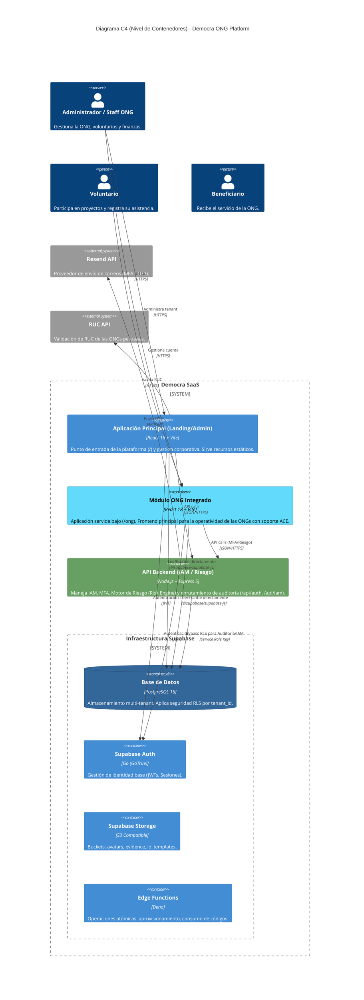

# Diagrama C4 (Nivel 2: Contenedores) - Arquitectura As-Is

*Fuente de verdad: `README.md`, `vite.config.js`, `server/index.js`*

A continuación se presenta el modelo C4 a nivel de contenedores de la plataforma SaaS Democra, reflejando su estado de despliegue y separación de responsabilidades actual.

## Notas del Diagrama

*   **Desacoplamiento Frontend/BaaS:** El diagrama ilustra una decisión arquitectónica fundamental; el frontend se comunica directamente con PostgreSQL para operaciones estándar delegando la seguridad a las políticas RLS, sin pasar por la API Express.
*   **Rol del API Express:** El API de Node.js actúa como un middleware especializado. No es un intermediario de CRUD general, sino un orquestador para flujos críticos (Risk Engine, OTP, Auditoría privilegiada).
*   **Enrutamiento Frontend:** A nivel de infraestructura (Vite/Vercel), ambas aplicaciones React (`app_landing` y `app_ong`) coexisten en el mismo dominio pero bajo diferentes "SPA Fallbacks" (`/` y `/ong`).
