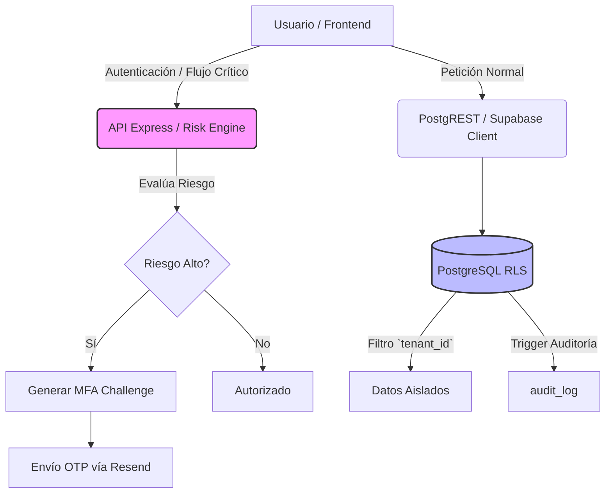

# Propuesta Única de Valor (Vaca Morada)

*Fuente de verdad: Inferido de la arquitectura del proyecto (`README.md`, `AUDIT_REPORT_S1.md`)*

En la metodología DDS, la "Vaca Morada" representa el diferenciador único que hace que este proyecto destaque frente a soluciones genéricas en el mercado de software para ONGs.

## 1. El Diferenciador Principal

El valor excepcional de **Democra** radica en la amalgama de un núcleo altamente seguro (común en banca) adaptado a las necesidades ágiles de organizaciones del tercer sector. Específicamente:

**"Un SaaS Multi-tenant impulsado por un motor de contexto dinámico (ACE) y auditoría inmutable, construido 100% sobre tecnologías nativas de base de datos sin fricción de middleware (Serverless First), pero con un motor de riesgo centralizado para flujos críticos."**

## 2. Pilares de la Vaca Morada

1.  **Access & Context Engine (ACE):** Las ONGs sufren con la rotación de voluntarios y accesos dispersos. El motor ACE permite invitar, revocar y cambiar el contexto (tenant) de un usuario fluidamente a través de enlaces (`access_links`), resolviendo la membresía (`memberships`) dinámicamente en cada consulta.
2.  **Aislamiento y Auditoría Forense por Diseño:** Al inyectar el identificador del tenant en PostgreSQL (`fn_current_tenant_id`) y gobernar los accesos mediante Row Level Security (RLS) combinado con un trigger de auditoría universal (`fn_trigger_audit_universal`), Democra asegura que ninguna filtración lógica en la interfaz de usuario (React) comprometa datos entre organizaciones, cumpliendo con estándares de privacidad de nivel clínico/médico.
3.  **Risk Engine Integrado:** A diferencia de proyectos típicos basados en BaaS que dependen puramente del login estándar, Democra introduce un *Risk Engine* en Node.js que evalúa huellas de dispositivos (`device_fingerprint`), sesiones, e inyecta desafíos OTP (MFA) dinámicamente cuando detecta patrones de riesgo, previniendo ataques automatizados de bots.

### Arquitectura Conceptual (La Vaca Morada)

