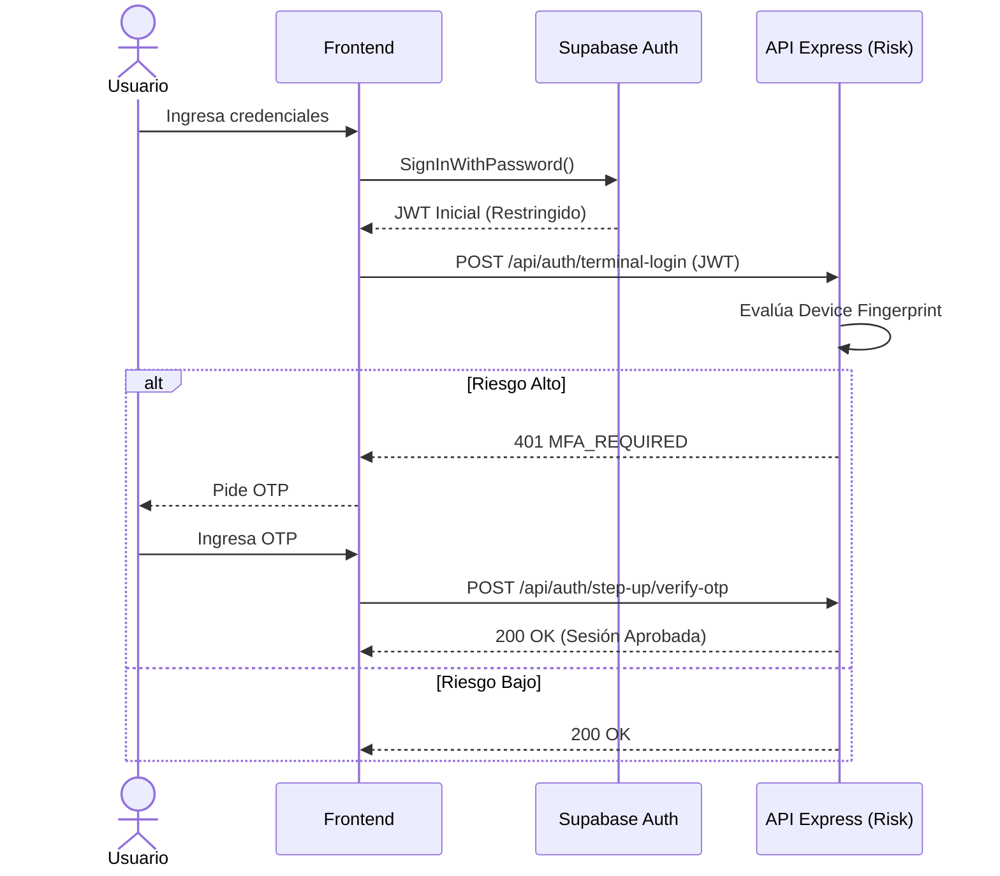

# Casos de Uso Principales

*Fuente de verdad: `server/index.js`, `DATABASE_DICTIONARY_S1.md`*

## 1. Módulo de Identidad y Acceso (IAM)

### 1.1. Iniciar Sesión (Login Híbrido)
*   **Actor:** Voluntario, Administrador.
*   **Flujo Principal:** 
    1. El actor envía credenciales a Supabase Auth.
    2. Supabase devuelve una sesión inicial.
    3. El backend intercepta (o el cliente redirige) para evaluar la huella del dispositivo en el Risk Engine (`server/index.js` -> `/api/auth`).
    4. Si se requiere MFA (Multi-factor Authentication), se crea un desafío (`mfa_challenges`) y se envía un OTP vía Resend.
    5. El actor ingresa el OTP; si es válido, obtiene acceso completo al sistema (`public.sessions`).
*   **Dependencias:** `profiles`, `mfa_challenges`, Supabase Auth, Resend.

### 1.2. Aprovisionamiento de Administradores (Bootstrap)
*   **Actor:** Super Administrador (Sistema).
*   **Flujo Principal:**
    1. A través de la Edge Function `admin-provision-user`, se invoca la función de base de datos `fn_bootstrap_tenant`.
    2. Se crea la entidad de la Organización (`tenants`).
    3. Se crea el perfil del administrador y se le asigna el rol máximo de la jerarquía (Owner).
    4. Se le asocian los contratos de suscripción iniciales (`subscription_contracts`).
*   **Dependencias:** Edge Function, `fn_bootstrap_tenant`.

## 2. Módulo de Organización (ACE)

### 2.1. Gestión de Invitaciones Contextuales
*   **Actor:** Administrador de ONG.
*   **Flujo Principal:**
    1. El actor genera un enlace de acceso especificando un rol y un límite de usos.
    2. El sistema guarda la entidad en `access_links`.
    3. Un nuevo usuario consume el enlace (`fn_complete_access_onboarding`).
    4. El sistema actualiza el `tenant_id` del perfil del nuevo usuario, y lo inscribe en `memberships` resolviendo los accesos necesarios a los dominios.
*   **Dependencias:** `access_links`, `memberships`.

## 3. Módulo Operativo (ONG y RRHH)

### 3.1. Admisión de Voluntarios
*   **Actor:** Postulante, Coordinador de RRHH.
*   **Flujo Principal:**
    1. El postulante llena un formulario público (o ingresa un código de registro legacy).
    2. Se genera un registro en `rrhh.solicitudes_admision`.
    3. El coordinador programa entrevistas y sube evidencia (`rrhh.entrevistas_admision`).
    4. Al aprobarse, el voluntario transiciona y se inserta en el catálogo maestro `ong.voluntarios`.
*   **Dependencias:** Schema `rrhh`.

### 3.2. Asignación y Registro de Asistencia
*   **Actor:** Voluntario.
*   **Flujo Principal:**
    1. El voluntario es asignado a un Proyecto -> Actividad.
    2. En el lugar del evento, el voluntario escanea su credencial QR.
    3. La función `ong.fn_register_attendance_scan` registra la fecha y hora en `ong.asistencias` validando que corresponda al tenant y la sede correcta.
*   **Dependencias:** `ong.actividades`, `ong.asistencias`, `ong.id_cards`.
