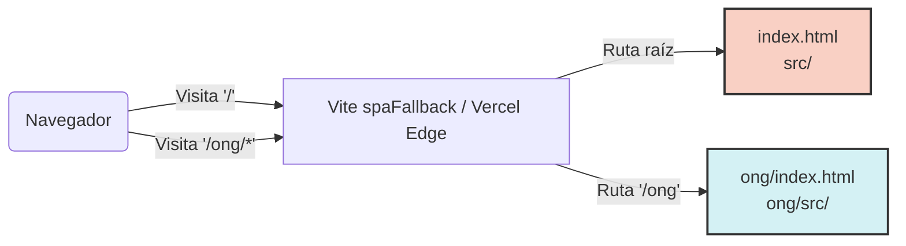

# Arquitectura de Componentes (Frontend React)

*Fuente de verdad: `vite.config.js`, `package.json`, `README.md`*

Democra implementa una arquitectura basada en **React 18** empaquetado con **Vite**.

## 1. Diseño Multi-Page Application (MPA)
A nivel de contenedor web, el proyecto rompe el molde tradicional de un Single Page Application gigante, dividiendo físicamente el frontend en dos aplicaciones bajo el mismo dominio configuradas en `vite.config.js`:
*   **Landing y Admin (`/`):** React renderizando sobre `src/`.
*   **Módulo ONG (`/ong`):** React renderizando sobre `ong/src/` (y su contraparte de código legacy en la raíz de carpeta `ONG/`).

## 2. Bibliotecas Base de Componentes
*   **Radix UI Primitives:** El proyecto usa exhaustivamente componentes sin estilo (headless) como `@radix-ui/react-dialog`, `@radix-ui/react-popover`, `@radix-ui/react-dropdown-menu`, etc. Esto garantiza una altísima accesibilidad (WAI-ARIA) sin acoplar el comportamiento a un diseño prefabricado.
*   **Gestor de Componentes / UI System:** Dada la presencia de Radix y Tailwind, se infiere una arquitectura de diseño propia (posiblemente inspirada en shadcn/ui o similar, debido a la mezcla de dependencias).
*   **Iconografía:** Lucide React (`lucide-react`).
*   **Animación:** Framer Motion (`framer-motion`) detectado en los chunks de Vite.

## 3. Manejo de Estado y Enrutamiento
*   **Estado Asíncrono (Data Fetching):** `@tanstack/react-query` v5. Maneja la caché, el retrying y el background fetching de las llamadas al cliente Supabase y al API Express.
*   **Routing:** `react-router` v7 (beta), manejando rutas anidadas dinámicamente y con lazy loading (configurado explícitamente en el middleware Vite).
*   **Formularios:** `react-hook-form` + `@hookform/resolvers` y `zod` para validación estricta de esquemas.
