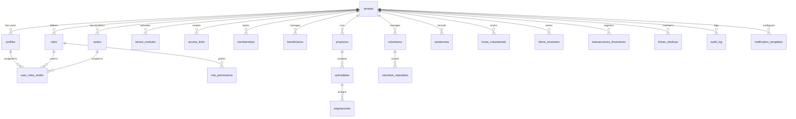

# 🗄️ Base de Datos — Democra

## Tecnología

- **Motor**: PostgreSQL 16 (gestionado por Supabase)
- **Acceso**: `@supabase/supabase-js` (sin ORM)
- **Multi-tenant**: Todas las tablas con `tenant_id` + Row Level Security
- **Migraciones**: 14 archivos SQL versionados en `supabase/migrations/`

## Esquema de entidades principales

## Tablas por dominio

### Core — Identidad y acceso
| Tabla | Propósito | Columnas clave |
|---|---|---|
| `tenants` | Organizaciones registradas | id, name, industry_type_id, plan_id, status_financial_id |
| `profiles` | Usuarios del sistema | id, tenant_id, full_name, email_verified_at |
| `roles` | Roles por tenant | id, tenant_id, name, hierarchy_level, is_system_role |
| `role_permissions` | Permisos granulares | role_id, permission |
| `sedes` | Sedes físicas | id, tenant_id, name |
| `user_roles_sedes` | Asignación RBAC | user_id, role_id, sede_id, tenant_id |
| `cat_permissions` | Catálogo de permisos | code, module, description |

### ACE — Access & Context Engine
| Tabla | Propósito | Columnas clave |
|---|---|---|
| `access_links` | Links de vinculación | code, type (VOLUNTEER_JOIN, STAFF_JOIN...), target_type, max_uses, expires_at |
| `memberships` | Membresías de usuarios | user_id, tenant_id, status, linked_via |
| `dynamic_forms` | Formularios dinámicos | tenant_id, form_schema (JSONB) |
| `role_module_access` | Acceso a módulos por rol | role_id, module_code |
| `role_field_permissions` | Permisos por campo | role_id, entity, field, access_level |

### ONG — Personas
| Tabla | Propósito |
|---|---|
| `beneficiarios` | Beneficiarios de la ONG |
| `voluntarios` | Voluntarios registrados |
| `fichas_medicas` | Registros clínicos confidenciales |
| `id_cards` | Carnets de identificación con QR |
| `volunteer_reputation` | Reputación y gamificación |
| `candidate_ocr_scoring` | Scoring de validación documental OCR |

### ONG — Operación
| Tabla | Propósito |
|---|---|
| `proyectos` | Proyectos sociales |
| `actividades` | Actividades dentro de proyectos |
| `asignaciones` | Asignación de personas a actividades |
| `asistencias` | Registro de asistencia |
| `horas_voluntariado` | Horas trabajadas con flujo de aprobación |
| `evidencias` | Evidencias documentales |

### ONG — Recursos
| Tabla | Propósito |
|---|---|
| `items_inventario` | Control de inventario |
| `movimientos_inventario` | Entradas y salidas |
| `transacciones_financieras` | Ingresos y egresos |
| `categorias_financieras` | Categorización presupuestaria |
| `comprobantes_financieros` | Comprobantes de pago |
| `cuentas_financieras` | Cuentas bancarias/caja |

### Sistema
| Tabla | Propósito |
|---|---|
| `audit_log` | Log inmutable de auditoría |
| `notification_templates` | Plantillas de notificación |
| `notification_history` | Historial de notificaciones |

## Migraciones versionadas

Las 14 migraciones siguen un patrón incremental y defensivo (idempotente con `IF NOT EXISTS`):

| Migración | Descripción |
|---|---|
| `20260301120000_ai_security_copilot.sql` | Tablas para el copiloto de seguridad IA |
| `20260302125000_fix_bootstrap_audit_tenant_null.sql` | Fix de auditoría en bootstrap |
| `20260302130000_fn_bootstrap_tenant_v2.sql` | Función RPC de onboarding idempotente |
| `20260305100000_schema_guard.sql` | Guards de integridad de esquema |
| `20260305110000_rls_hardening_p0.sql` | Hardening de RLS (248 líneas) |
| `20260305_rls_hardening.sql` | RLS adicional (248 líneas) |
| `20260510000000_ace_fase0_base_structures.sql` | ACE: access_links, memberships, dynamic_forms |
| `20260510100000_ace_fase1_onboarding_rpc.sql` | ACE: funciones RPC de onboarding |
| `20260510200000_ace_fase2_legacy_sync.sql` | ACE: sincronización con legacy |
| `20260510210000_ace_fase3_rls_policies.sql` | ACE: políticas RLS (12,760 bytes) |
| `20260510220000_ace_fase4_optimization.sql` | ACE: índices y optimización |
| `20260706120000_fn_get_user_redirect_target.sql` | Función de redirección post-login |
| `20260725150000_profile_email_verification.sql` | Verificación de email en profiles |
| `20260728_post_dev_complete_schema.sql` | Esquema completo post-desarrollo (27KB) |

## Funciones almacenadas

| Función | Tipo | Descripción |
|---|---|---|
| `fn_current_tenant_id()` | `SECURITY DEFINER` | Resuelve el tenant_id del usuario autenticado via `auth.uid()` |
| `fn_has_permission(p_permission, p_sede_id)` | RPC | Verifica si el usuario tiene un permiso específico |
| `fn_is_tenant_admin()` | RPC | Verifica si el usuario es admin del tenant |
| `fn_bootstrap_tenant(...)` | RPC | Crea tenant + admin + plan en una transacción atómica |
| `fn_get_user_redirect_target()` | RPC | Determina a dónde redirigir al usuario post-login |
| `fn_set_updated_at()` | Trigger | Actualiza `updated_at` automáticamente en cada UPDATE |
| `fn_trigger_audit_universal()` | Trigger | Registra cambios en `audit_log` automáticamente |

## Características de integridad

- **Foreign keys con cascada**: `ON DELETE CASCADE` para datos dependientes, `ON DELETE SET NULL` para referencias opcionales
- **CHECK constraints**: Validación a nivel de columna (ej: `type IN ('VOLUNTEER_JOIN','STAFF_JOIN',...)`)
- **NOT NULL**: Campos críticos siempre obligatorios
- **Defaults defensivos**: `DEFAULT '{}'::jsonb`, `DEFAULT NOW()`, `DEFAULT 0`
- **Índices compuestos**: `(tenant_id, campo_filtro)` para queries multi-tenant eficientes
- **Idempotencia**: `CREATE TABLE IF NOT EXISTS`, `DROP POLICY IF EXISTS` antes de crear
